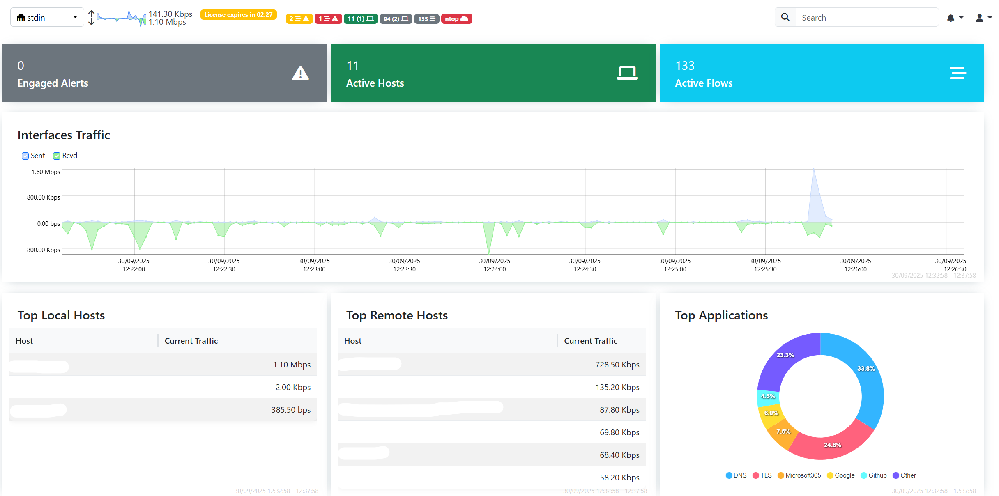

# Fritzbox WAN Traffic Monitor

This project provides a simple way to monitor WAN traffic from a Fritzbox router using Docker. It consists of a shell script that dumps traffic data and a Docker setup for easy deployment.

NOTE : This may produce slow downs on the WAN speeds. I tested this with the FRITZ!Box 7530 AX and the NIC can't handle this without the bandwidth problem. This works for well for quick monitoring but is not production ready. However this may work on other Fritz!Boxes without problems but I have not tested any other. 

## Features
- Collect WAN traffic data from Fritzbox
- Run traffic dump scripts in a containerized environment
- Easy setup with Docker Compose



## Project Structure
```
fritz-dumper/
  Dockerfile         # Docker image definition for fritz-dumper
  entrypoint.sh      # Entrypoint script for the container
  fritzdump.sh       # Main script to dump Fritzbox WAN traffic
docker-compose.yml   # Docker Compose configuration
```

## Getting Started

### Prerequisites
- Docker
- Docker Compose

### Setup
1. Clone this repository:
```   
   git clone (https://github.com/Jutop/Fritzbox-WAN-traffic-Monitor-Ntopng-Docker-2025.git)
   cd "Fritzbox WAN traffic Monitor"
```  
2. Build and start the container:
```   
   docker compose up -d
 ```

### Usage
- The main script `fritzdump.sh` will run inside the container and collect WAN traffic data from your Fritzbox.
- You can customize the script or Docker setup as needed for your environment.

## Configuration
- Edit `fritz-dumper/fritzdump.sh` to adjust Fritzbox connection details or data collection parameters.
- Modify `docker-compose.yml` for environment variables or volume mounts if needed.

## License
This project is licensed under the GNU General Public License v3. See the [LICENSE](LICENSE) file for details.

Forked from and created a DOCKER image with proper updates and flags to ntopng:latest :


https://raw.githubusercontent.com/ntop/ntopng/dev/tools/fritzdump.sh

---

For questions or issues, please open an issue in this repository.


